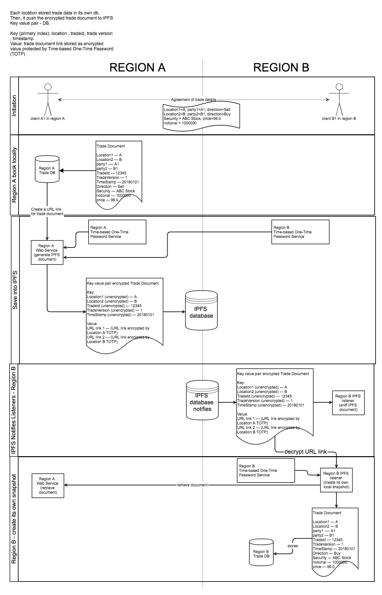

# IPFS Decentralized Trade Store example

# Problem
In some countries, especially in Asia, there is restriction that trade information can only be stored locally wihtin their countries.

If you have business across Asia, you need to comply with local law and split your data across multiple instances of storage in different countries.

For financial business, such as security trading, it will be a challenge in long run :
- Silo based storage introduces duplication of data in cross regional trades
- Need of synchronization (manual/automatic) across region for above duplicated data
- Lack of consolidated view for financial analysis
- Higher cost to cover maintenance cost of N database instances

In old days, corporation tries to consolidate all region of data into one single database. Now, it is not workable.

# Solution - Use of IPFS to link up all silo storage
While each location has its own database for trdade storafe
In region A, a client A1 enters a trade with client B2 in region B.

In IPFS, sensitive information is encrypted by AES by TOTP.
AES is a symmetric encryption algorithm where encryption and decryption with same password.
To avoid reader guessing the original content from large collection of ciphers, we make AES password time based.
TOTP : https://en.wikipedia.org/wiki/Time-based_One-time_Password_Algorithm
is composed of
- secret key (not shared by location specific)
- Time stamp
by crptographic hash function (https://en.wikipedia.org/wiki/Cryptographic_hash_function)
Reader cannot guess the secret key easily from the time-based password.

the key fields are:
- Location1
- Location2
- TradeId
- TradeVersion
- Timestamp (to generate the TOTP)

value:
- URL link of the trade document protected by TOTP of a location

